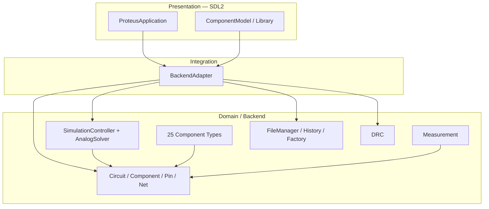

# ⚡ Proteus OOP Circuit Simulator

A complete, object-oriented electronic circuit simulator inspired by Proteus,
written in modern **C++17** with an **SDL2** graphical frontend.


> 🇮🇷 Persian documentation (راهنماهای فارسی) is available under [`docs/`](docs/).

---

## 📑 Table of Contents

- [Overview](#-overview)
- [Feature Highlights](#-feature-highlights)
- [Architecture](#-architecture)
- [Repository Layout](#-repository-layout)
- [Getting Started](#-getting-started)
- [Running the Tests](#-running-the-tests)
- [Documentation](#-documentation)
- [Team & Division of Labor](#-team--division-of-labor)
- [Project Status](#-project-status)

---

## 🎯 Overview

Course project for **Object-Oriented Programming**, Faculty of Electrical
Engineering, **Sharif University of Technology**.
The goal was to design and implement a Proteus-like schematic editor and
circuit simulator with a clean, layered, testable OOP architecture.

The result is a **mixed-signal simulator**: an analog MNA solver cooperates
with a digital propagation engine, driving 25 component types, live
interaction, measurement instruments and a small 8051-style microcontroller.

---

## ✨ Feature Highlights

| Area | Capabilities |
|---|---|
| **Components** | 25 types in 7 categories: sources, passive, interactive, digital gates, ADC/DAC, MCU/Memory/LCD/Keypad, measurement |
| **Simulation** | Run / Pause / Step / Stop state machine, live editing while running, mixed analog+digital settling |
| **Analog engine** | Modified Nodal Analysis (MNA), Backward-Euler C/L models, piecewise LED, two-terminal sources with internal resistance |
| **Digital engine** | 3-valued logic (LOW/HIGH/UNDEFINED) with dominance rules, propagation delay, edge-triggered D-FF |
| **MCU** | 8051-style ISA + educational ISA, RAM/Flash, bidirectional GPIO ports, Intel-HEX firmware loader |
| **Instruments** | Voltmeter, Ammeter, 2-channel Oscilloscope, voltage probe |
| **Editor** | Grid snap, rotate/mirror, box selection, junctions, 90° wiring, undo/redo, properties dialog |
| **Files** | Token-based serialization, recent projects, hardened deserialization |
| **Quality** | DRC (ground / shorts / floating / islands), **155 automated tests** |

---

## 🏗️ Architecture

The codebase is strictly layered; the UI never touches the domain directly.



See [`docs/ARCHITECTURE.md`](docs/ARCHITECTURE.md) for the full design.

---

## 📁 Repository Layout

```
oop_project_proteus/
├── CMakeLists.txt
├── README.md
├── docs/                      # All documentation
│   ├── ARCHITECTURE.md        # Design, layers, decisions
│   ├── TEAM_AND_PROCESS.md    # Division of labor & workflow
│   ├── integration_guide.md   # UI↔Backend contract (FA)
│   ├── COMPONENT_SIMULATION_AUDIT_FA.md
│   ├── GIT_MERGE_GUIDE_FA.md
│   ├── PART7_NOTES.md
│   └── FRONTEND_TEST_CHECKLIST.md
├── scripts/                   # Sync helpers
├── src/
│   ├── main.cpp               # Single entry point
│   ├── core/                  # Vector2D, Pin, Component, Circuit
│   ├── wiring/                # Wire, Junction, Net
│   ├── components/            # sources / passive / interactive / digital / advanced
│   ├── measurement/           # Probe, Voltmeter, Ammeter, Oscilloscope
│   ├── simulation/            # SimulationController, AnalogSolver
│   ├── file/                  # FileManager, History, ComponentFactory
│   ├── drc/                   # DRC, LogBuffer
│   ├── integration/           # BackendAdapter
│   └── ui/                    # ProteusApplication, ComponentModel
└── tests/
    ├── test_main.cpp          # 105 backend checks
    └── test_integration.cpp   # 50 integration checks
```

---

## 🚀 Getting Started

**Prerequisites:** CMake ≥ 3.16, a C++17 compiler, SDL2 + SDL2_gfx.

```bash
# macOS
brew install sdl2 sdl2_gfx sdl2_image sdl2_ttf

# Build
cmake -S . -B build
cmake --build build -j 8

# Run the simulator
./build/ProteusOopSimulator
```

---

## 🧪 Running the Tests

```bash
./build/run_tests             # 105 backend checks
./build/run_integration_tests # 50 integration checks
```

Both suites must finish with **0 failures**.

---

## 📚 Documentation

| Document | Purpose |
|---|---|
| [`docs/ARCHITECTURE.md`](docs/ARCHITECTURE.md) | Essence, layers, domain model, design decisions |
| [`docs/TEAM_AND_PROCESS.md`](docs/TEAM_AND_PROCESS.md) | Division of labor, git workflow, milestones |
| [`docs/integration_guide.md`](docs/integration_guide.md) | How to connect UI to the backend (FA) |
| [`docs/COMPONENT_SIMULATION_AUDIT_FA.md`](docs/COMPONENT_SIMULATION_AUDIT_FA.md) | Simulation engine audit & component models (FA) |
| [`docs/GIT_MERGE_GUIDE_FA.md`](docs/GIT_MERGE_GUIDE_FA.md) | Conflict-free teamwork guide (FA) |
| [`docs/PART7_NOTES.md`](docs/PART7_NOTES.md) | Advanced library (MCU/ADC/DAC/LCD/Keypad) |
| [`docs/FRONTEND_TEST_CHECKLIST.md`](docs/FRONTEND_TEST_CHECKLIST.md) | Manual UI test checklist |

---

## 👥 Team & Division of Labor

| Member | Sections | Focus |
|---|---|---|
| **Mohsen** | 5, 6, 9, 10, 11 | Wiring, base components, measurement, file mgmt, DRC (backend lead) |
| **Melika** | 1, 2, 7 | Menus, design canvas, advanced component library |
| **Hana** | 3, 4, 8 | Component library UI, editing, simulation control |

Strategy: **backend-first with high testability** — every domain feature ships with automated tests before UI integration.

---

## 📈 Project Status

- ✅ Backend core (wiring, components, measurement, file, DRC)
- ✅ Advanced library (MCU, ADC/DAC, LCD, Keypad, Memory)
- ✅ SDL2 frontend + full integration
- ✅ Mixed-signal analog solver (MNA)
- ✅ 155 automated tests, all green
- 🏷️ Tagged release: `v1.0-final`